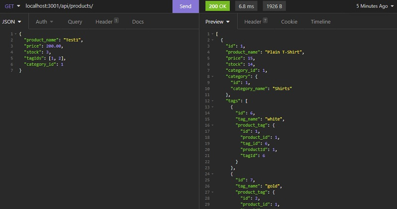

# the Best E-Commerce Back End

## Description
I made the Best E-Commerce Back End.

This application works with API testing tools, such as: Insomnia.

This application is used to create tables for the user's inventory. The application can be used to review, update, delete the inventory via Insomnia.

GitHub Repository: [https://github.com/jhur628/theBestECommerceBackEnd](https://github.com/jhur628/theBestECommerceBackEnd)

Video Demo: [https://watch.screencastify.com/v/NQFbaZ42I2qDX067B0VJ](https://watch.screencastify.com/v/NQFbaZ42I2qDX067B0VJ)

## Table of Contents
### [Installation](#Installation)
### [Usage](#Usage)
### [Credits](#Credits)
### [Questions](#Questions)
### [Screenshots](#Screenshots)

## Installation
Run schema.sql on mysql. Then, run the server.js file in the root directory. Then run the index.js file in the seeds directory.
## Usage
When the user has followed the installation directions, the user can access the server via localhost:3001/ in their API testing tool.

The user is able to access the ecommerce_db through three routes: "/categories", "/products", and "/tags". For each route, the user may GET, GET by ID, POST or create, PUT or update, and DELETE into each table.
## Credits
A lot of credit should be given to my peers. They were very helpful, and I always seem to learn a lot from them.
## Questions
Have any questions?  
Contact me at hur.john628.com.  
Github: https://github.com/jhur628/  
## Screenshots

